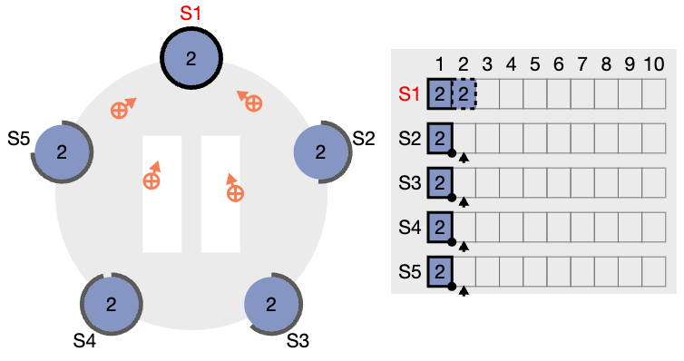
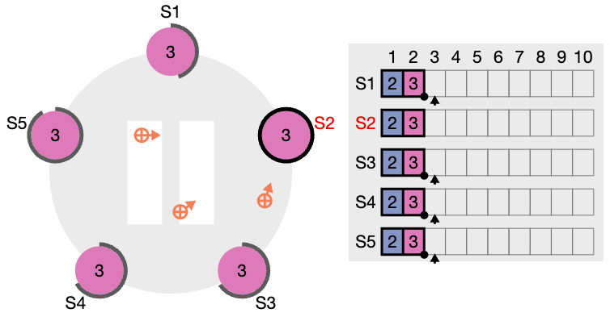
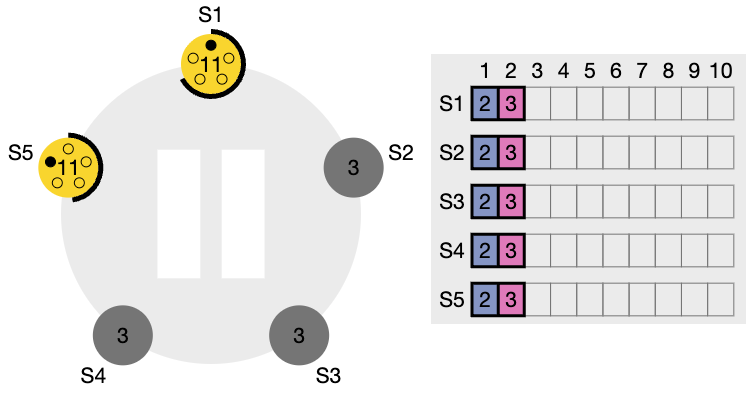
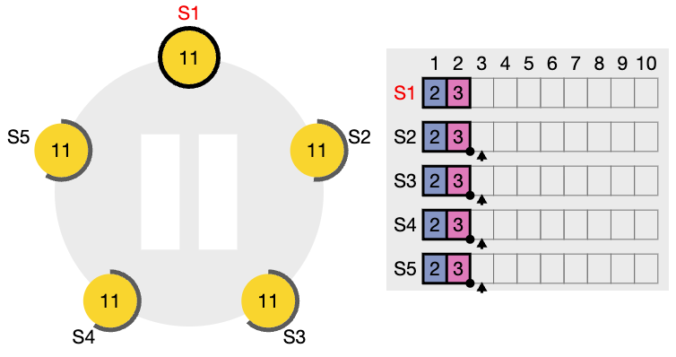

Assignment 5 Report
---------------------

# Team Members
- Thierry Suhner
- Karla Ruggaber

# GitHub link to your (forked) repository

https://github.com/thierrysuhner/DS_Assignment5

# Task 1

Note: Some questions require you to take screenshots. In that case, please join the screenshots and indicate in your answer which image refer to which screenshot.

1. What happens when Raft starts? Explain the process of electing a leader in the first
term.

Ans: When Raft starts, firstly all servers start in the Follower state. To elect a leader in the first term, each Follower uses a randomized election timeout. This is not interrupted as there are yet no heartbeats as there is not yet a Leader. The first Follower whose timeout expires increments its current term (e.g. to Term 1), votes for itself and transitions to the Candidate state. The Candidate then sends RequestVote RPCs to all other servers (and resets its election timer). If the Candidate receives votes form the majority of the servers, it wins the election and becomes the Leader. The new Leader then immediately sends out heartbeats (AppendEntries RPCs) to maintain ints authority and prevent new elections.

2. Perform one request on the leader, wait until the leader is committed by all servers. Pause the simulation.
Then perform a new request on the leader. Take a screenshot, stop the leader and then resume the simulation.
Once, there is a new leader, perform a new request and then resume the previous leader. Once, this new request is committed by all servers, pause the simulation and take a screenshot. Explain what happened?

Ans: Initially, the first client request is successfully replicated and committed by the original Leader S1 (Term 1) to a majority of followers. The leader appends it to its log and all servers show the entry in the committed state (solid border). When the simulation is paused for the second request, S1 records this entry in its log. Since the Leader is stopped before it can replicate this entry to a majority, the entry remains uncommitted (dashed border) on S1 and is not seen in the logs of the Followers.
As the Leader is now stopped, the Followers no longer receive heartbeats, so they start a new election, where S2 is elected as the Leader for the new Term. S2 accepts the third request, appends it to its log and replicates it to a majority of Followers, so it is commited, all servers show the entry with solid borders. As the old leader is resumed, it then recognizes that its term is outdated and steps down to a Follower, the new leader S2 brings its log back in sync: The second entry before we paused the first time (uncommitted) will be discarded, it was never replicated. However, the new, committed entry from the new leader is replicated. This leads us to all servers containing the committed entry from the new leader S2 and the uncommitted entry from the old leader S1 being overwritten. This is according to Log Matching and Leader Completeness rules/properties of Raft, which guarantee that the new leader's log (S2) must eventually contain all committed entries. It shows what Raft does to keep logs consistent after a leader "crash".

**Screenshot Task 1, Question 2, Nr. 1**

**Screenshot Task 1, Question 2, Nr. 2**

3. Using the same visualization, stop the current leader and two additional servers. After a few increments, pause the simulation and take a screenshot. Then resume all servers and restart the simulation. After the leader election, pause the simulation and take a screenshot. How do you explain the behavior of the system during the above exercise?

Ans: When we stop the current leader and two additional servers, there are only two running nodes left. Because of the election process of Raft, it is then impossible for any of these two to become the leader. This is because the cluster has an original size of five, so the majority of 5 is 3, which is the amount of votes a node needs to be elected as a Leader. As the two nodes only vote for themselves and get the vote from the other one, they always just have 2/5, so no one of them can get a majority of votes. This results in the two nodes just repeatedly incrementing their current term and starting new elections after their randomized election timeout has run through, as all the elections fail. Then, after resuming all the nodes again the election process can again be successful, where one node gets a majority of votes and becomes the Leader. This will be one of the nodes that were left active before (in our case S1), as it already is in Candidate modes when the other 3 nodes are reactivated, so it sends out RequestVote RPCs immediately to the others who are in Follower state. Also, when the reactivated nodes receive these RPCs, their term is updated to the one of the Candidate (which is much higher now than their previous one).

**Screenshot Task 1, Question 3, Nr. 1**

**Screenshot Task 1, Question 3, Nr. 2**

# Task 2

1. Which server is the leader? Can there be multiple leaders? Justify your answer using the statuses from the different servers.

Ans: Looking at the statuses from the different servers (/admin/status endpoint), we can see that node1 (port 8080) is the leader. This is because all of the 3 have `TCPNode('node1:6000')` as its leader, and node1 is in state 2 (leader state), whereas the other two are in state 0 (follower state). There can't be multiiple leaders, as Raft guarantees Election Safety – a node only becomes leader after having received the majority of votes (in our case, 2/3), so its not possible that another server gets the same amount of votes or i.e. is a leader at the same time.

2. Perform a PUT operation for the key "a" on the leader. Check the status of the different nodes. What changes have occurred and why (if any)?

Ans: 
The status has changed on all of them. We have noted these major changes:
Leader (node 1):
- `log_len` has increased by 1 (from 2 to 3) as the leader has appended a new entry into its own log
- `last_applied` has increased by 1 (from 2 to 3)
- `commit_idx` has increased by 1 (from 2 to 3)
- `next_node_idx_server_node2:6001` and the same for `_node3:6002` have increased by 1 (from 3 to 4) to keep track of the value of the next index of the two follower nodes, which is the index of the next log entry that the leader will attempt to send to that follower
- `match_idx_server_node2:6001` and the same for `_node3:6002` have increased by 1 (from 2 to 3) also to keep track of the follower nodes, but this time the match index is the index of the largest log entry on the leader's log that the leader knows is also replicated (matched) on the specific follower
- `leader_commit_idx` has increased by 1 (from 2 to 3) as the leader has committed the new entry successfully
and of course the `uptime` because the server was running for a longer time

Followers (node 2 and 3):
- `log_len` has increased by 1 (from 2 to 3) as the leader replicated the new entry to both followers
- `last_applied` has increased by 1 (from 2 to 3)
- `commit_idx` has increased by 1 (from 2 to 3) 
- `leader_commit_idx` has increased by 1 (from 2 to 3) as the leader has succesfully commited the new entry to all servers
and of course also the `uptime` because the server was running for a longer time

`last_applied` and `commit_idx` have increased by 1 on all nodes as the majority of servers have stored the new entry, so it was committed (both followers as well as the leader applied it to the state machine).

3. Perform an APPEND operation for the key "a" on the leader. Check the status of the different nodes. What changes have occurred and why (if any)?

Ans: 
Leader (node 1):
- `log_len` has increased by 1 (from 3 to 4) as the leader has appended an entry ("mouse" to the key "a") in its own log
- `last_applied` has increased by 1 (from 3 to 4)
- `commit_idx` has increased by 1 (from 3 to 4) 
- `next_node_idx_server_node2:6001` and the same for `_node3:6002`have increased by 1 (from 4 to 5) with the same reason as above for the PUT
- `match_idx_server_node2:6001` and the same for `_node3:6002` has increased by 1 (from 3 to 4) with the same reason as above for the PUT
- `leader_commit_idx` has increased by 1 (from 3 to 4) as the leader has committed the appending of the entry ("mouse to key "a") successfully
and of course the `uptime` because the server was running for a longer time

Followers (node 2 and 3):
- `log_len` has increased by 1 (from 3 to 4) as the leader replicated the appending of the new entry ("mouse" to "a") to both followers
- `last_applied` has increased by 1 (from 3 to 4)
- `commit_idx` has increased by 1 (from 3 to 4) 
- `leader_commit_idx` has increased by 1 (from 3 to 4) as the leader has committed the appending of the entry ("mouse to key "a") successfully
and of course the `uptime` because the server was running for a longer time

`last_applied` and `commit_idx` have increase for the same reason as above for PUT.

All in all, this shows us that the leader appended a new log entry and replicated it to the majority of the follower nodes successfully (-> all nodes now also show the value "mouse" in the list of values for the key "a"). This also complies with the core principle of Raft that every state-changing operation must be recorded as a new entry in the replicated log.

4. Perform a GET operation for the key "a" on the leader. Check the status of the different nodes. What changes have occured and why (if any)?

Ans: There have been no real changes to the status of the different nodes, only the uptime naturally increased as the nodes ran for a longer time in the meanwhile. This is natural, as the GET operation is a read-only request, it doesn't modify the state of the replicated state machine, so it doesn't need to be recorded as a new entry in the log which would change stuff.

# Task 3

1. Shut down the server that acts as a leader. Report the status changes that you get from the servers that remain active after shutting down the leader. What is the new leader (if any)?

Ans: In this case, after shutting down our original leader (node 1), the remaining two nodes still have the possibility to become a leader, as there are still 2/3 (i.e., the majority) of nodes active. This results in the two remaining nodes continuing to operate and starting a new leader election (after random timeout), as there were no more heartbeats received from node 1. In our case, node 2 has become the new leader, as its election timeout was first to expire. node 3 remained a Follower. We can confirm this by looking at the statuses of the two remaining nodes:

node2: Many changes as the leader has more attributes than a follower node. Of the already existing ones:
- `state` changed from 0 to 2, as node2 is the new leader
- `leader` changed from node1 to node2
- `next_node_idx_count` has increased from 0 to 2 as this is now important for node2 as the new leader
- `match_idx_count` has increased from 0 to 2
- `partner_node_status_server_node1:6000` has changed from 2 to 0, as node 1 isn't the leader anymore and is not reachable anymore
- `log_len`, `last_applied`, `commmit_idx`and `leader_commit_idx` all increased by 1
- `raft_term` increased from 1 to 3, as we are in a new term after our previous leader (node1) has gone offline and the two remaining nodes let their election timeouts expire

node3:
- `state` remained 0 (node 3 is still a follower)
- `leader` changed from node1 to node2 because of the new election
- `partner_node_status_server_node1:6000` has changed from 2 to 0, as node 1 isn't the leader anymore and is not reachable anymore
- `log_len`, `last_applied`, `commmit_idx`and `leader_commit_idx` all increased by 1
- `raft_term` increased from 1 to 3 as we are in a new term after our previous leader (node1) has gone offline and the two remaining nodes let their election timeouts expire

All the log/index/last_applied attributes changed for the same reason as above.

1. Perform a PUT operation for the key "a" on the new leader. Then, restart the previous leader, and indicate the changes in status for the three servers. Indicate the result of a GET operation for the key "a" to the previous leader.

Ans: Changes in status:
node1: Restarted, has entirely new status 
node2: 
- `partner_node_status_server_node1:6000` now is 2 again (before it was 0) as the node1 is up and running again
- All the usual log_len/last_applied/commit_idx/leader_commit_idx have increased by 1 because of the PUT operation
- The `next_node_idx_server_node1:6000` has increased from 3 to 5, and `_node3:6002` has increased from 4 to 5

node3:
- `partner_node_status_server_node1:6000` now is 2 again (before it was 0) as the node1 is up and running again
- `log_len`/`last_applied`/`commit_idx`/`leader_commit_idx` all increased by 1 as usual for a state-changing operation

The result of the GET operation for the key "a" on the previous leader node1 yielded the following result: `curl http://localhost:8080/keys/a          
["cat","dog"]`. This means, that the leader node2 has successfully replicated the committed state of the value of key a to the newly running node1.

3. Has the PUT operation been replicated? Indicate which steps lead to a new election and which ones do not. Justify your answer using the statuses returned by the servers.

Ans: As already said and showed above, the PUT operation has been replicated. This can also be verified by looking at the `commit_idx` of all servers, that match (in our case they are 4). There is a new election only if the previous leader does not send out heartbeats anymore, which eventually lets the random election timeout of the remaining nodes expire, which results in the node voting for itself and transitioning to the Candidate state. The Candidate then sends RequestVote RPCs to all other servers (and resets its election timer). Another option for a new election would be a split vote (no-one receives a majority of votes from the cluster). If a follower node is shut down / unavailable, this doesn't trigger a new election. All of this can be seen in the status reports above, where we see that the state of node2 changes as it gets elected as the new leader after node1 (the previous leader) was shut down.

4. Shut down two servers: first shut down a server that is not the leader, then shut down the leader. Report the status changes of the remaining server and explain what happened.

Ans: After shutting down a server that is not the leader:
- `partner_node_status_server_node2:6001` has changed its value from 2 to 0, as it's now unavailable

After shutting down the server that was the leader too:
- `has_quorum` changes from True to False, as the remaining single server node3 immediately loses its ability to form a quorum (a majority, only 1/3 remaining)
- `partner_node_status_server_node1:6000` has changed its value from 2 to 0, as it's now also unavailable
- Interestingly, the leader stays unchanged as `TCPNode('node1:6000')`. As there is just node3 left as the last server, the system is stuck, it can't make any progress, and also no majority can be formed anymore for a new leader election. So the remaining server can't change its record of the leader, a change would require a new election, and winning that requires a quorum. This means that the remaining server will experience election timeouts, but every election it starts will fail instantly as there is no majority to win.

5. Can you perform GET, PUT, or APPEND operations in this system state? Justify your answer.

Ans: No, in this system state, we can't perform GET/PUT/APPEND operations anymore. This is because the system has no quorum anymore, so there is no leader, which results in PUT and APPEND not being accepted since writing requires a leader + majority. Furthermore, GET also doesn't work because the remaining node3 is in follower state without a leader, so PySyncObj doesn't serve GET requests anymore. In total, the system is completely unavailable until a leader is back.

6. Restart the servers and note down the changes in status. Describe what happened.

Ans: node3 as the last remaining server from before becomes the new leader immediately. Once the two servers node1 and node2 came back online, they detected the higher term of node3 and changed their state to follower, node3 then updated the logs of them to bring the up to date (by sending them the missing log entries). Thus, all 3 show the `commit_idx` and `last_applied` as 3, they are on the same page. We now have quorum again and node3 as the new leader.

Changes in status of node3:
- `state` 2 changed from 0 and `leader` is now node3
- `has_quorum` is True again
- Both `partner_node_status_server_node1:6000` and `_node2:6001` are now 2 again, not 0 as they are back up
- `log_len`/`last_applied`/`commit_idx`/`leader_commit_idx` all increased by 1 as usual for a state-changing operation
- `next_node_idx_count`/`match_idx_count` changed from 0 to 2 as before
- `raft_term` increased by 1 (1 to 2) as we have a new term now where node 3 is the leader
+ all the attributes that are for the leader were added

## Network Partition

For the first experiment, create a network partition with 2 servers (including the leader)
on the first partition and the 3 other servers on the other one. Indicate the changes that occur in the status of a server on the first partition and a server on the second partition. Reconnect the partitions and indicate what happens. What are the similarities and differences between the implementation of Raft used by your key/value service (based on the PySyncObj library) and the one shown in the Secret Lives of Data illustration from Task 1? How do you justify the differences?

Ans: Changes in the status after partitioning node1 and node2 in one, and node3/4/5 in the other partition:
node2 (partition 1):
- `leader` changed from node1 to None, as it's not anymore possible for the first partition to elect a new leader, as they are only 2/5 nodes that can speak to eachother, so there is no majority to win an election
- `has_quorum` changed from True to False, as there are only 2/5 nodes left reachable in the first partition
- `partner_node_status_server_node3:6002`/`_node4:6003`/`_node5:6004` are now all 0 instead of 2, because they are unreachable because of the partitioning 
- `raft_term` is continously increasing as the two remaining nodes node1 and node2 continuously try to get elected after their respective random election timeouts have surpassed. However, they will never be elected, as this is not possible without quorum.

node3 (partition 2):
- `leader`changed from node1 to node4 as the old leader node1 became unavailable as it was partitioned in the other partition. In the new eleciton process, node4 apparentl won.
- `partner_node_status_server_node2:6001` is now 0 instead of 2, because it is unreachable because of the partitioning. Interestingly, node1 still has the status 2 here. We expect this to be because this is a temporary, optimistic view held by node3 as its internal failure detection timer hasn't expired yet for node1.
- `last_applied`/`commit_idx`/`leader_commit_idx` increased by 1 as always because of the changes that happended
- `raft_term` increased from 1 to 3 as we are in a new term with node4 being the leader

Changes after reconnecting:
node2 (was partition 1):
- `leader` is now node1, not None anymore, as there was a new election that succeeded after reconnecting all the node together
- `has_quorum` is back to True as now all 5 nodes are back in one partition
- all `partner_node_status_server_node...` are back to 2 from 0 as they are all back available for node2
- `log_len`/`last_applied`/`commit_idx`/`leader_commit_idx` all increased by 2 (from 2 to 4) for the updates received by the node regarding the cluster properties incl. leader

node3 (was partition 2):
- `leader` is now node1, as there was a new election that was won by node1 apparently
- all `partner_node_status_server_node...` are back to 2 from 0 as they are all back available for node3
- `log_len`/`last_applied`/`commit_idx`/`leader_commit_idx` all increased by 1 (from 3 to 4) for the updates received by the node regarding the new cluster properties. it already got the update for node4 being the leader before, which is why it only increases by 1 and not by 2 as node2 does.
- `raft_term` has increased drastically, as the minority partition increased it while being disconnected. After the reconnection, the highest raft_term was updated for all nodes.

So after reconnecting, the cluster must resolve the situation where the minority partition's servers may have timed out and attempted an election, resulting in higher term numbers, while the majority partition was stable. The servers in the minority partition  weill eventually receive heeartbeats from the leader in the majority partition. However, the servers in the minority partition have incremented their term more and more while attempting to elect a new leader during the isolation. When the leader of the majority thus receives something from a minority partition server, they compare term numbers, the leader sees that the term number of the minority partition's server is higher, and thus reverts to Follower state and updates its own term to the higher one. Afterwards, there is a new election countdown triggered and afterwards a new election process, where any of the servers is now able to gain the majority of votes and become the new leader. Once elected, the new Leader forces consistency across all nodes. Any divergent log entries that were created but never committed during isolation are overwritten and discarded, ensuring all servers agree on the system state.

Similarities of PySyncObj Library and Secret Lives of Data:
- Core Raft Components: Both implement core States (Leader/Follower/Candidate) and the two main RPCs (RequestVote and AppendEntries/Heartbeat)
- Log Replication: Both ensure client commands are appended to Leader's log and replicated to a majority of Followers before being considered committed
- Leader Election: Both rely on randomized timeouts to trigger elections and ensure new leader is chosen by receiving majority of votes. This means that only the majority partition can elect a new leader.
- Both start with 5 nodes in the cluster, and then split up the cluster into two partitions, where the leader was assigned to the minority partition
- After reconnection, nodes will roll back their uncommited entries and match the new leader's log, which ensures that the log is constistent across our cluster again

Differences:
- In the Secret Lives of Data, the partitions now both have a leader in their partition. The minority keeps the leader from before, and the majority partition elects a new one. In ouor implementation, the minority partition nodes eventually loose their leader, they have none and try to elect a new one over and over, which is also why th raft_term continuously increases.
- In the Secret Lives of Data, the client can still (try) to set values. There are actually two clients illustrated, one for each partition. The one for the majority partition can set the values as usual (as the leader can replicate to a majority), however the client for the minority partition will try to set the value, but the leader can't replicate to a majority so its log entry stays uncommitted. In our implementation, all interaction with the cluster is blocked. This is to ensure that user interaction can actually commit the changes and not only tries to.
- After reconnection, in the Secret Lives of Data, the minority leader with the lower raft term value steps down and synchronizes his logs with the majority leader. In our implementation, there is only one leader remaining, the one from the majority partition. However, he still steps down when he sees the higher raft term values from the minority partition, a new election will start afterwards.
- The term numbers in our implementation are incremented much faster due to shorter election timeouts

-> Justifications: Our implementation is based on a real-world library (PySyncObj), whereas the secret lives of data is only a teaching visualization. So the implementation is much more saftey and performance-oriented (e.g. quicker elections or blocking of potentially unpossible operations). 

For the second experiment, create a network partition with 3 servers (including the
leader) on the first partition and the 2 other servers on the other one. Indicate the changes that occur in the status of a server on the first partition and a server on the second partition. Reconnect the partitions and indicate what happens. How does the implementation of Raft used by your key/value service (based on the PySyncObj library) compare to the one shown in the Secret Lives of Data illustration from Task 1?

Ans: After partitioning, for the majority partition, the only thing that changes is the `partner_node_status_server_node...` for the two nodes that are in the other partition (in our case 4 and 5). They will be set to 0, as these nodes are now unavailable due to partitioning. For the two nodes in the minority partition, the leader will eventually be none, the quorum False and also the `partner_node_status_server_node...` which will be 0 for the three nodes in the other partition as before. As there is no majority in this partition (only 2/5 nodes), there will be no quorum and the leader will not be existent, as every election process fails due to not enough votes (only 2 out of 5). Therefore, the raft term will continuously increase for every try the nodes make of an election. After reconnection, the original leader of the majority partition will step down as soon as he sees the higher raft term value of a minority partition server, after that there will be a new leader election for the whole cluster. Therefore, the nodes from the majority cluster will receive a new leader, furthermore all the nodes are now available again (value 2 instead of 0) and due to the update of the log entry all the indices and log_len/last_applied etc. will increase by 1. And of course the raft term gets updated to the higher value of the minority partition servers. For the minority servers, there is now a new leader (the same for everyone in the cluster now), the quorum will be regained to True, all partner nodes are available again (2 instead of 0) and all the indices/log_len etc. will be incremented by 1 due to the log update.

Comparsion of PySyncObj Library and Secret Lives of Data: Apart from the similarities and differences already named above, we have imagined some more here. Unfortunately, we did not find the same situation as ours (2 partitions, no starting leader in minority partition) on the indicated website thesecretlivesofdata.com/raft as defined in the assignment. But here are our assumptions on how it would work, based on the rest we have seen of this visualization:

Similarities 
- The majority partition keeps its leader, while the minority partition will loose the orginal leader we have "cut off" as his heartbeat signals don't make it to the minority nodes anymore.
- In both, the minority partition cannot elect a new leader as there is no majority there with enough votes to select a new leader

Differences
- PySyncObj uses log compaction, which results in the log_len differing from the demo sometimes. This is clearly because the implementation is used for the real-world / production code, whereas the visualization is just there to learn.

# Task 4

1. Raft uses a leader election algorithm based on randomized timeouts and majority voting, but other leader election algorithms exist. One of them is the bully algorithm, which is described in Section 5.4.1 of the Distributed Systems book by van Steen and Tanenbaum. Imagine you update the PySyncObject library to use the bully algorithm for Raft (as described in the Distributed Systems book) instead of randomized timeouts and majority voting. What would happen in the first network partition from Task 3?

Ans: In the first network partition from task 3, we have a majority partition of 3 nodes with no initial leader, and a minority partition of 2 nodes with the original leader in it. Assuming this leader was already picked using bully algorithm, this will be node 5. So, if nodes nr 1, 2 and 3 are in the majority partition, one of them will notice first, that the initial leader is not reachable anymore. Lets assume, its node nr 1. It then sends an ELECTION message to all the processes higher than it, namely node number 2 and 3. Nodes 2 and 3 then both respond with OK, so node 1 knows that its job is over. Then, both node 2 and 3 hold elections, each one sending messages only to those nodes with identifiers higher than itself. Then, node 3 knows that node 4 is not available and that it is the winner. So node 3 can then tell node 2 that it will take over.Then, it announcees the takeover by sending a COORDINATOR message to all running processes. This is because the node with the highest id can declare itself leader when it can't reach nodes with a higher id.  So naturally, in the minority partition, the initial leader (node 5) will stay as the leader, as it's still the node with the highest id. After reconnection, nodes 4 and 5 are restarted, so node 5 will then send all the others a COORDINATOR message and bully them into submission. (This will lead to conflicting logs and inconsistencies in the end, which is why Raft does not use this algorithm but majority election)

2. Why is it that Raft cannot handle Byzantine failure? Explain in your own words.

Ans: Raft is fundamentally designed only to handle crash failures where a server stops communicating / fails to follow protocol. It can't handle Byzantine failure (servers acting arbitrarily / maliciously), as the algorithm assumes all active non-faulty servers are honest and will correctly follow protocol rules. For example, raft's majority quorum for committing entries and trusting successful responses to AppendEntries RPCS, breaks down if a byzantine minority provides false confirmations / exploits Leader model. Furthermore, a Byzantine Leader could propose inconsistent logs, thereby violating safety properties.
